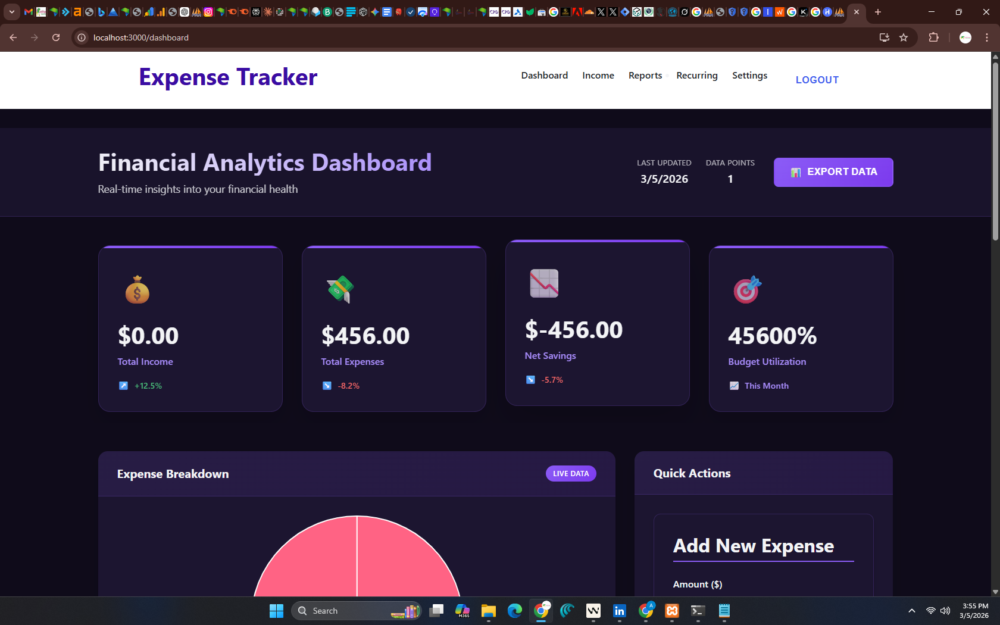

# Expense Tracker Pro 🚀

[](https://opensource.org/licenses/MIT)  
[](https://github.com/Alex-Muhscience/expense-tracker/actions)  
[](https://www.docker.com/)  
*Last Updated: March 5, 2026*

Take control of your finances with **Expense Tracker Pro**, a comprehensive full-stack web application designed for complete financial management. Featuring user authentication, interactive analytics dashboard, budget tracking, recurring transactions, dynamic categories, and professional support pages, this project is a powerful solution for personal and small business financial tracking.

## 🌟 Overview

Expense Tracker Pro allows you to log expenses and income, categorize transactions dynamically, set budgets with progress tracking, manage recurring bills, visualize financial data with interactive charts, and access comprehensive support resources. Built with modern technologies and professional UI/UX, it's perfect for personal finance management or as a foundation for financial SaaS applications.



- **Purpose**: A comprehensive financial management solution and demonstration of modern full-stack development
- **Status**: Feature-complete with advanced analytics, open to contributions and further enhancements

## 🛠️ Tech Stack

- **Frontend**: React, React Router, Chart.js (pie and bar charts), Bootstrap-like CSS
- **Backend**: Flask, Flask-JWT-Extended, SQLAlchemy, Flask-CORS
- **Database**: MySQL with dynamic category management
- **DevOps**: Docker, Docker Compose, Gunicorn
- **Deployment**: Heroku, Netlify, Vercel, Render
- **Security**: JWT authentication, password hashing, rate limiting

## ✨ Features

### 🔐 **Authentication & Security**
- Secure user registration and login with JWT tokens
- Password change functionality
- Account deletion with data cleanup
- Rate limiting and security headers

### 💰 **Financial Management**
- **Expense Tracking**: Add, edit, delete expenses with dynamic categories
- **Income Management**: Track multiple income sources with full CRUD
- **Dynamic Categories**: User-managed categories stored in database
- **Budget Management**: Set budgets per category with visual progress bars
- **Recurring Transactions**: Manage bills, subscriptions, and regular payments

### 📊 **Analytics & Visualization**
- **Professional Dashboard**: KPI metrics with trend indicators
- **Interactive Charts**: Pie charts for expense breakdown, bar charts for income vs expenses
- **Real-time Analytics**: Live data updates and comprehensive financial overview
- **Reports Page**: Monthly income vs expense comparisons

### ⚙️ **User Experience**
- **Settings Page**: Profile management, data export, account controls
- **Dark Theme**: Professional purple-themed UI throughout
- **Responsive Design**: Mobile-first approach with adaptive layouts
- **Export Functionality**: CSV downloads for expenses and incomes

### 📚 **Support & Documentation**
- **Help Center**: Comprehensive FAQ and user guides
- **Privacy Policy**: Detailed data protection and privacy information
- **Terms of Service**: Legal terms and conditions
- **Contact Page**: Support form and business information

### 🐳 **DevOps & Deployment**
- **Containerized**: Full Docker support for consistent environments
- **Production Ready**: Gunicorn, environment variables, error handling
- **API Documentation**: RESTful endpoints with JWT protection
- **Database Management**: SQLAlchemy ORM with migration support

## 🚀 Getting Started

### Prerequisites
- Docker and Docker Compose installed.
- Node.js and npm for the frontend.
- Python 3.12+ with `pip`.

### Installation
1. Clone the repository:
   ```bash
   git clone https://github.com/Alex-Muhscience/expense-tracker.git
   cd expense-tracker
   ```
2. Set up environment variables:
   - Create a `.env` file in the `backend` folder with `JWT_SECRET_KEY=your-secret-key`.
3. Build and run with Docker:
   ```bash
   docker-compose up --build
   ```
4. Access the app:
   - Frontend: [http://localhost:3000](http://localhost:3000)
   - Backend API: [http://localhost:5000](http://localhost:5000)

## 🚀 Deployment

### Prerequisites for Production
- Set up environment variables securely (do not commit secrets).
- Ensure database is set up (e.g., MySQL on cloud provider like AWS RDS or PlanetScale).
- For HTTPS, use a reverse proxy or platform that provides SSL certificates.

### Backend Deployment
The backend is a Flask app using Gunicorn for production.

1. **Heroku**:
   - Create a new Heroku app.
   - Set config vars (environment variables): `DB_USER`, `DB_PASSWORD`, `DB_HOST`, `DB_PORT`, `DB_NAME`, `JWT_SECRET_KEY`, `LOG_LEVEL=INFO`, `CORS_ORIGINS=https://your-frontend-domain.com`.
   - Add a `Procfile` in the backend directory: `web: gunicorn app:app`
   - Push the backend code to Heroku git or connect GitHub repo.

2. **Render**:
   - Create a new Web Service.
   - Connect your repository, set build command to `pip install -r requirements.txt`, start command to `gunicorn app:app`.
   - Set environment variables as above.

3. **Using Docker**:
   - Build the image: `docker build -t expense-backend ./backend`
   - Run with: `docker run -p 5000:5000 --env-file .env expense-backend`
   - For orchestration, use Docker Compose with production environment.

### Frontend Deployment
The frontend is a React app built with `npm run build`.

1. **Netlify**:
   - Build the app: `npm run build` (creates `build/` folder).
   - Upload the `build` folder to Netlify or connect the repo.
   - Set build command: `npm run build`, publish directory: `build`.
   - Update API calls to point to the production backend URL.

2. **Vercel**:
   - Connect the repository to Vercel.
   - Vercel will automatically detect React and build it.
   - Set environment variables if needed, and update API base URL.

3. **GitHub Pages** (for static hosting):
   - Use `gh-pages` package to deploy the build folder.

### Environment Variables
- Create a `.env` file in the backend directory for local development.
- For production, use the platform's environment variable settings.
- Example `.env`:
  ```
  DB_USER=your_db_user
  DB_PASSWORD=your_db_password
  DB_HOST=your_db_host
  DB_NAME=expense_tracker
  JWT_SECRET_KEY=your_secret_key
  LOG_LEVEL=INFO
  CORS_ORIGINS=https://your-frontend.com
  ```

### Database Setup
- For production, use a managed MySQL service like AWS RDS, Google Cloud SQL, or PlanetScale.
- Run migrations if needed (currently using SQLAlchemy auto-create).

### Monitoring
- Use Heroku logs or add logging to external services like LogRocket for monitoring.

## 🧪 Testing
- Test cases included:
  - Successful user registration and login.
  - Adding an expense with valid data.
  - Fetching expenses for an authenticated user.
  - Invalid input handling (e.g., negative amount).
  - CSV export functionality.
- Run tests manually by interacting with the app or add unit tests with `unittest` in the future.


## 🤝 Contributing

Interested in enhancing this project? Fork the repository, submit a pull request, or open an issue. Suggestions for features like budget alerts or mobile optimization are welcome!

## 📜 License

This project is licensed under the [MIT License—](https://opensource.org/licenses/MIT)see the `LICENSE` file for details.

## 🙌 Acknowledgments

- Built with the help of open-source tools like React, Flask, and Docker.
- Inspired by the need for simple, effective financial tracking solutions.

## 🌐 Connect With the Project

- [GitHub Repository](https://github.com/Alex-Muhscience/expense-tracker)
- Open an issue or submit a pull request to collaborate!

Let’s make expense tracking cooler together! 🚀